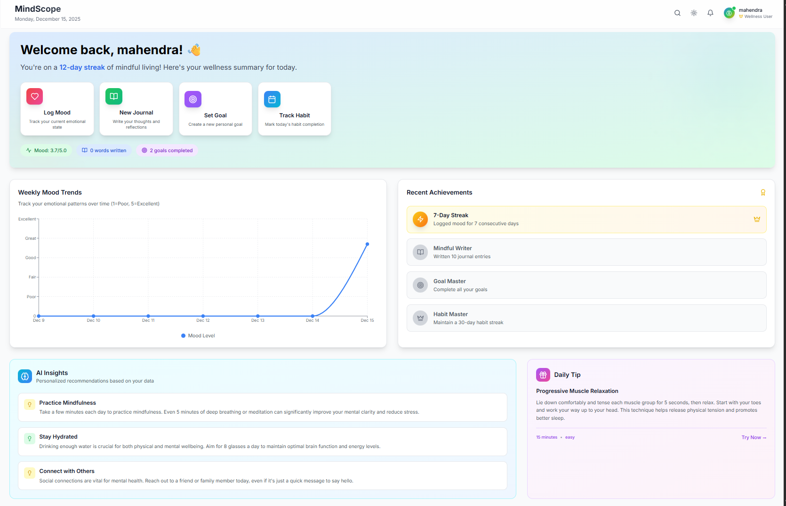
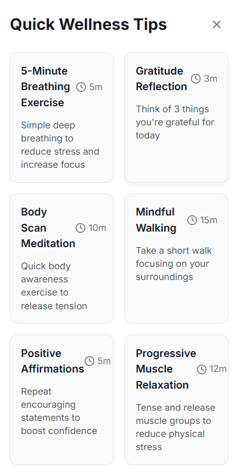
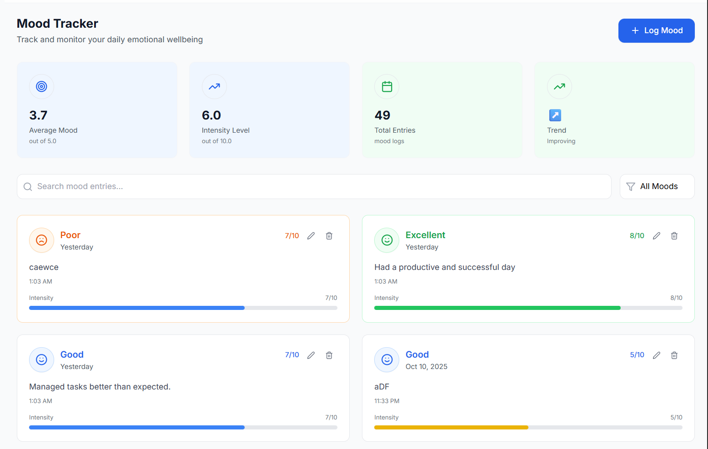
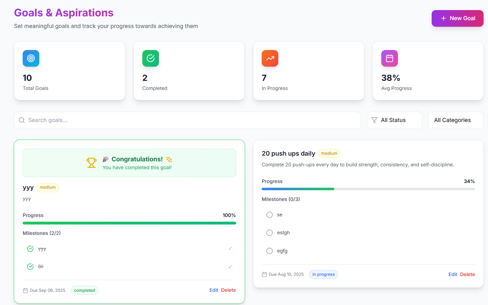
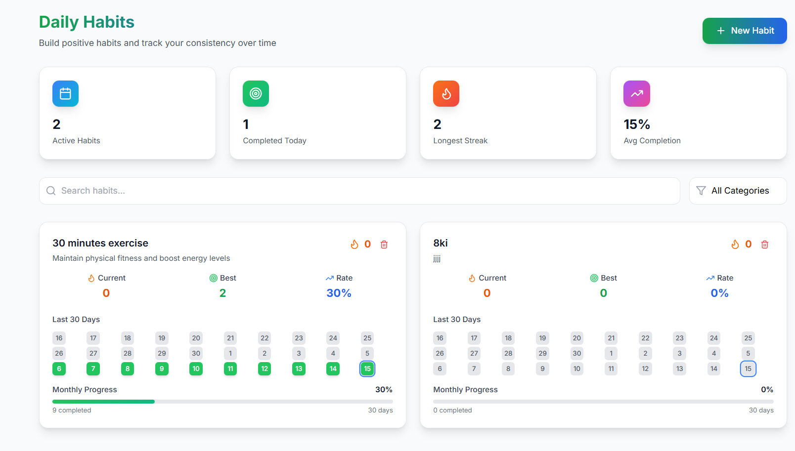

# 🧠 MindScope – AI-Powered Mental Wellness Platform


MindScope is a **full-stack MERN mental wellness web application** designed to help users understand, track, and improve their mental well-being.
It combines **mood tracking, journaling, habit building, goal management**, and **AI-powered insights** into a single unified platform.

The application focuses on **clean UI, structured data analytics, and personalized AI recommendations** to deliver a meaningful and scalable wellness experience.

---

## ❓ Why MindScope?

Most mental wellness applications focus on isolated features.
MindScope takes a **holistic approach** by integrating multiple wellness aspects and analyzing user behavior patterns to provide **actionable insights powered by AI**.

This project demonstrates **full-stack engineering, secure authentication, scalable architecture, and real-world AI integration**.

---

## 🚀 Key Features

* **User Authentication** – Secure JWT-based login & registration
* **Mood Tracking** – Log daily moods with intensity and notes
* **Journaling** – Write, organize, and reflect with structured entries
* **Goal Management** – Create goals with milestones and progress tracking
* **Habit Tracking** – Build habits with streak calculation and calendar view
* **Analytics Dashboard** – Visualize wellness trends using interactive charts
* **AI-Powered Insights** – Personalized recommendations using Google Gemini
* **Dark / Light Mode** – Theme support for better accessibility
* **Responsive Design** – Optimized for desktop and mobile devices

---

## 🛠️ Tech Stack

### Frontend

* React 18 + TypeScript
* Tailwind CSS
* Framer Motion
* Recharts
* React Router
* React Hook Form
* date-fns

### Backend

* Node.js & Express.js
* MongoDB with Mongoose
* JWT Authentication
* Express Validator
* CORS & Helmet
* API Rate Limiting

### AI

* Google Gemini API for personalized wellness insights

---

## 📁 Project Structure

```
MindScope/
├── src/                    # Frontend (React + TypeScript)
│   ├── components/         # Reusable UI components
│   ├── pages/              # Application pages
│   ├── hooks/              # Custom React hooks
│   ├── services/           # API services
│   ├── types/              # Type definitions
│   └── utils/              # Utility functions
│
├── server/                 # Backend (Node + Express)
│   ├── controllers/        # Request handlers
│   ├── models/             # MongoDB schemas
│   ├── routes/             # API routes
│   ├── middleware/         # Authentication & validation middleware
│   └── index.js            # Server entry point
│
├── assets/                 # Screenshots & demo media
└── README.md
```

---


## 📸 Screenshots


| Dashboard Overview | Quick Wellness | Authentication |
|--------------------|----------------|----------------|
|  |  |  |

| Mood Tracking | Journaling |
|---------------|------------|
|  |  |

| Goals Management | Habit Tracking |
|------------------|---------------|
|  |  |

|

---

## 🎥 Demo Video

A complete walkthrough demo will be added after final deployment.

---

## 🚀 Getting Started (Local Setup)

### Prerequisites

* Node.js (v18+)
* MongoDB Atlas or local MongoDB
* npm or yarn

---

### Frontend Setup

```bash
git clone https://github.com/mahendra8432/MindScope.git
cd MindScope
npm install
npm run dev
```

Frontend runs at:

```
http://localhost:5173
```

---

### Backend Setup

```bash
cd server
npm install
npm run dev
```

Backend runs at:

```
http://localhost:5000
```

---

### Environment Variables

Create a `.env` file inside `server/`:

```
MONGO_URI=your_mongodb_connection_string
JWT_SECRET=your_jwt_secret
GEMINI_API_KEY=your_gemini_api_key
PORT=5000
NODE_ENV=development
```

Note: Keep all environment variables private and out of version control.

---

## 📡 API Overview

* `/api/auth` – Authentication routes
* `/api/moods` – Mood tracking
* `/api/journals` – Journal entries
* `/api/goals` – Goal management
* `/api/habits` – Habit tracking
* `/api/analytics` – Dashboard analytics
* `/api/ai` – AI insights

Note: All routes (except authentication) are protected using JWT middleware.

---

## 🔒 Security Practices

* JWT-based authentication
* Input validation on all routes
* API rate limiting to prevent abuse
* Secure CORS configuration
* Helmet for HTTP security headers
* Environment-based secrets handling

---

## 🌟 UI / UX Highlights

* Clean and modern dashboard layout
* Smooth animations and transitions
* Clear data visualizations
* Loading states & error handling
* Mobile-friendly and accessible design

---

## 🚀 Deployment

The project is designed to be **deployment-ready**.

* **Frontend:** Vercel / Netlify
* **Backend:** Render / Railway
* **Database:** MongoDB Atlas

---

## 🔮 Future Enhancements

* AI-based mood prediction
* Voice-based journaling
* Therapist / admin dashboard
* Push notifications & reminders
* Cloud storage for journal attachments

---

## 👨‍💻 Author

**Mahendra Bansode**
Final-year CSE (AIML) student
Aspiring Full-Stack & AI Engineer

---

## ⭐ Resume Highlight

Built **MindScope**, a production-grade MERN mental wellness platform featuring secure JWT authentication, analytics dashboards, and Gemini-powered AI insights, designed with a scalable full-stack a

